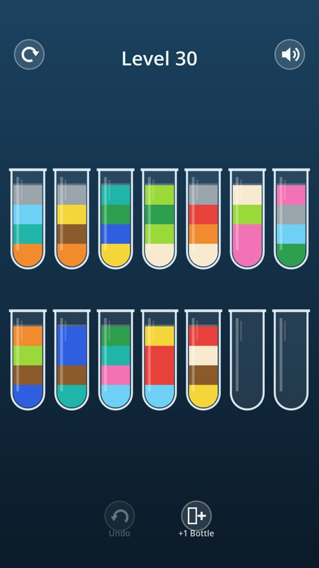
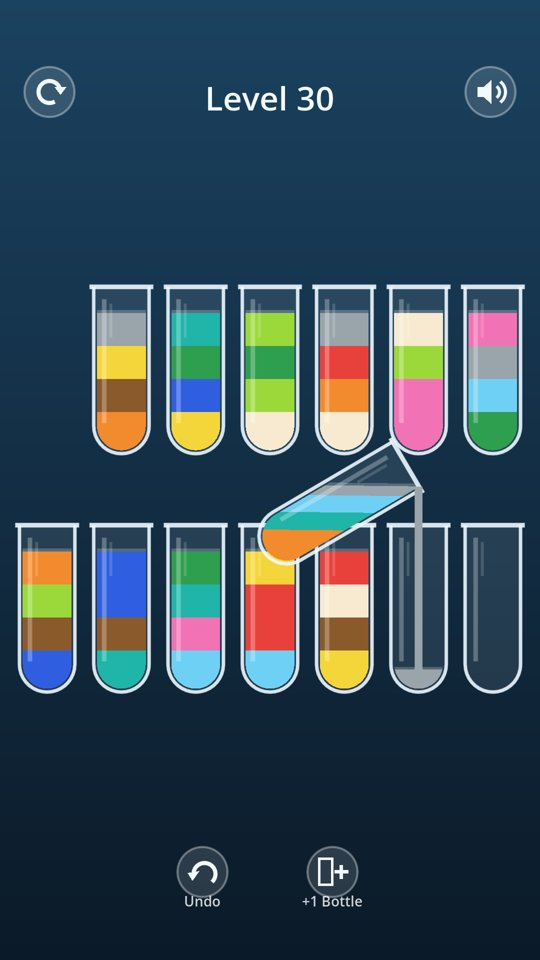
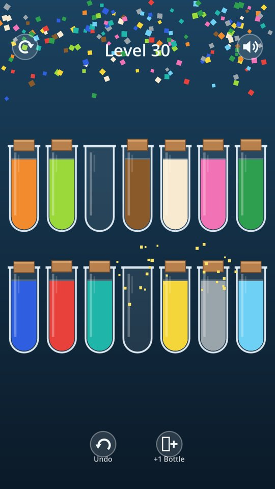

# Water Sort

A color-sorting water puzzle for Android. Tap a bottle, then tap another, and the top color pours across if it matches or the target bottle is empty. A level is solved when every bottle holds a single color.

**No ads, no in-app purchases, no internet permission, no tracking.**

**[Download the latest APK](https://github.com/Matswm86/water-sort/releases/download/latest/water-sort.apk)** (debug-signed; allow "Install from this source" when Android asks).

| Level 30 | Pouring | Level complete |
|---|---|---|
|  |  |  |

## Features

- Endless levels. Level N is generated from a fixed seed, so the same number always gives the same puzzle, and every level is checked solvable by a built-in solver before you see it.
- Difficulty ramps from 2 colors to 12 colors by level 27, with 4 units per bottle and 2 empty bottles.
- Tilting pour animation: the liquid keeps a level surface and its volume while the bottle tips.
- Unlimited undo, one free extra bottle per level, restart.
- Corked bottles and sparkles when a color is complete, confetti on level complete.
- Calm music loop and water sounds (synthesised by `tools/make_audio.py`), one tap to mute.
- Works offline; progress is saved on the phone.

## Build

Godot 4.6.2, GL Compatibility renderer. GitHub Actions builds the APK on every push to `main` and publishes it to the rolling `latest` release (`.github/workflows/build-android.yml`).

Local playthrough test (plays a solver solution through the tap API and saves screenshots):

```bash
CAPTURE_DIR=/tmp/shots CAPTURE_LEVEL=8 godot --path . --resolution 1080x1920 res://tests/capture.tscn
```

## License

MIT.
